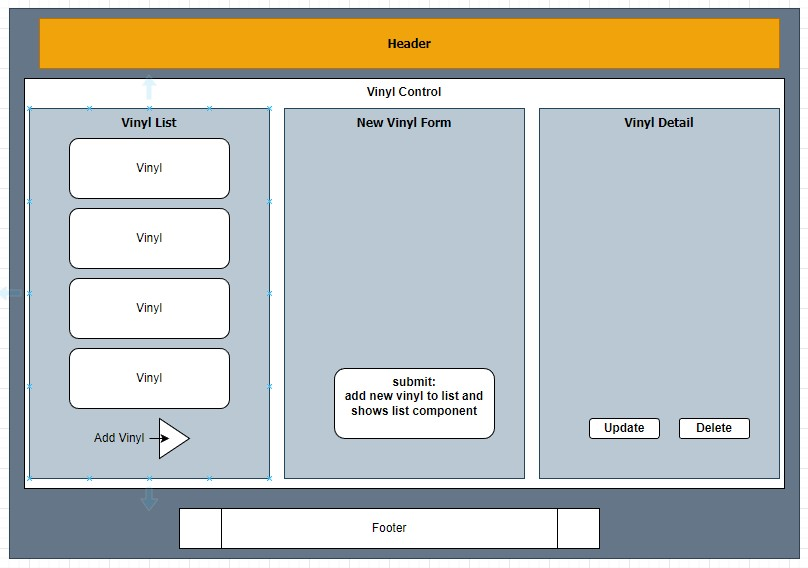
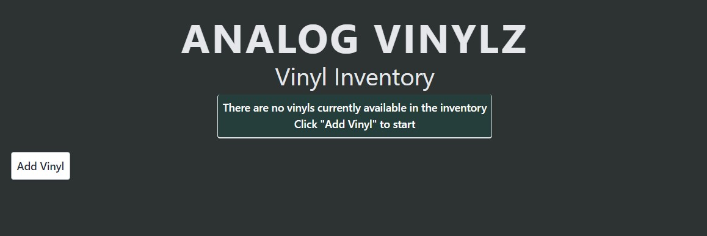
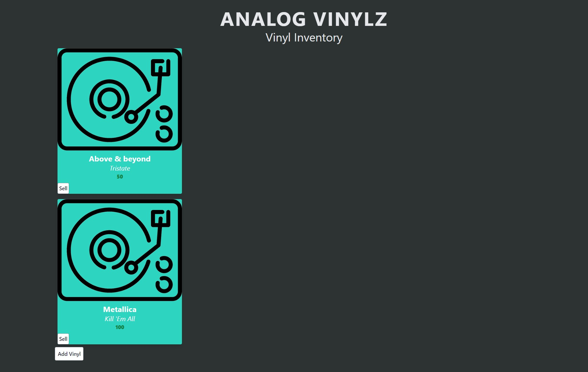

# Analog Vinyl Shop Inventory tracker

#### By: _Peter Philavanh_

### _A React application to track inventory of a Vinyl shop_

## Technologies Used

* _JavaScript_
* _React_
* _Tailwind CSS_
* _node.js_

## Setup/Installation Requirements
* Clone this repository to your local machine
* Navigate to the projects root directort by entering `$cd vinyl-shop`
* Intall dependencies by entering `$npm install`
* Run application by entering `$npm run start`
* Navigate the application via the localhost url on your browser

## Description
_This application was built for an Epicodus code review. It was built to be a dedicated inventory tracking application using React and React fundamentals. The user has full CRUD functionality._

## Component Diagram
_This diagram shows the initial planning of how and where properties are being passed through the different elements._

## Empty Splash Page
_Initial splash page with no listed items will return a message_

## Listed Splash Page
_Once a vinyl has been added, it is displayed via a card_

## Known Bugs
* _First card will switch back and forth with second card after clicking sell button_
* _Report any bugs to efl2ice89@gmail.com_

## License
* Peter Philavanh, March 2023. Available for distribution, modification, inspection, and application under [GPLv3 License](https://www.gnu.org/licenses/gpl-3.0.en.html)